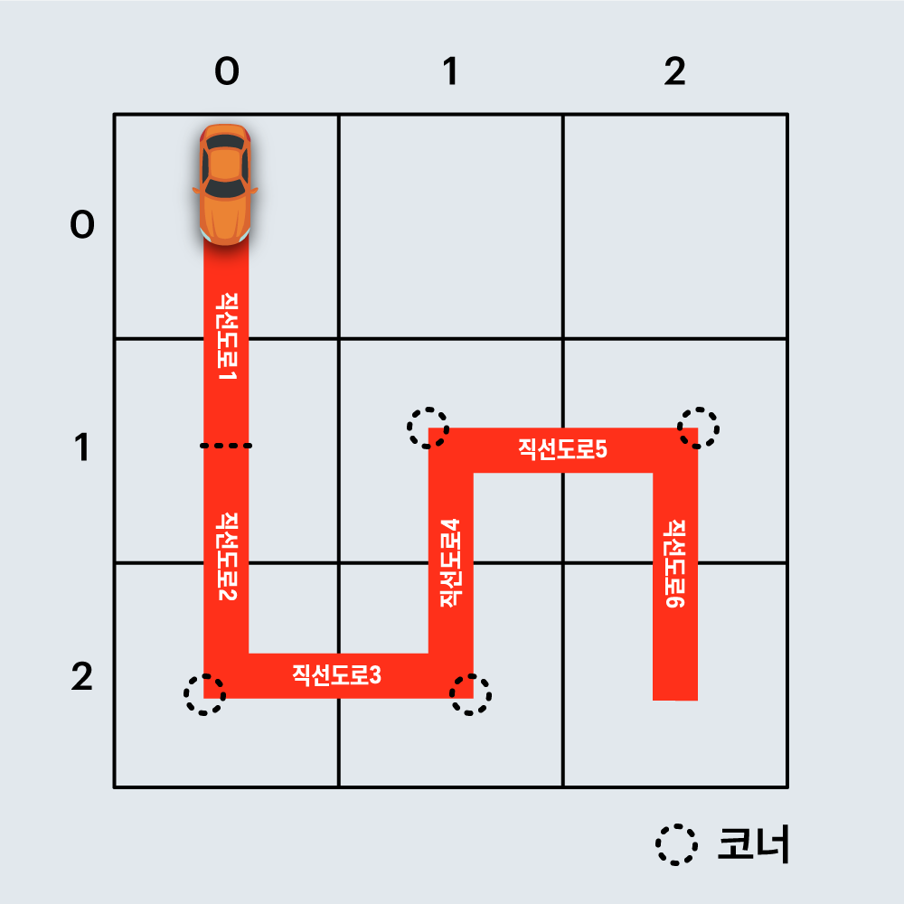
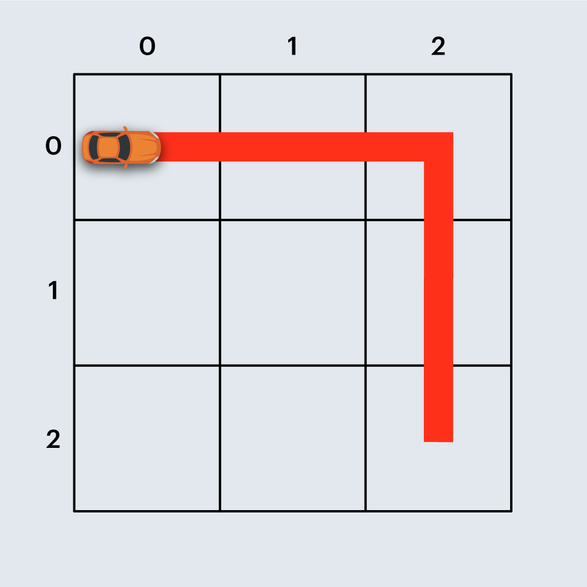
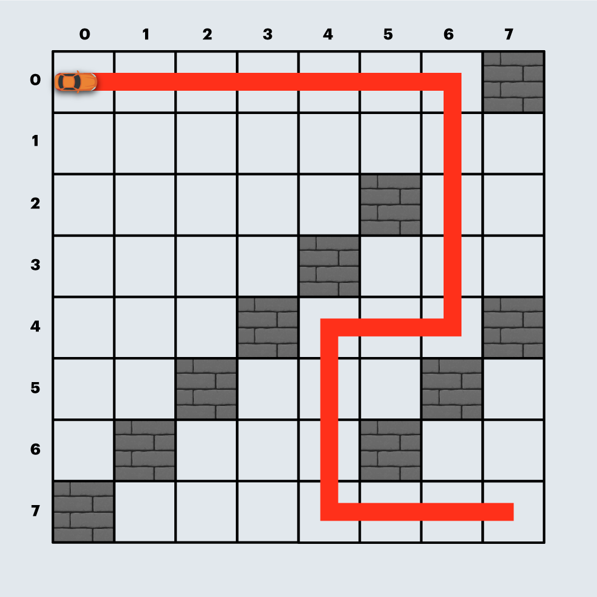
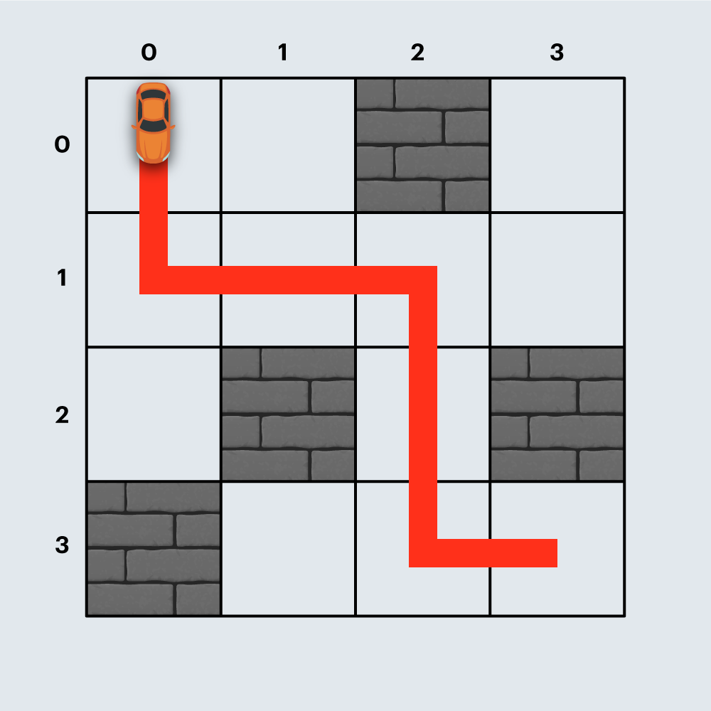
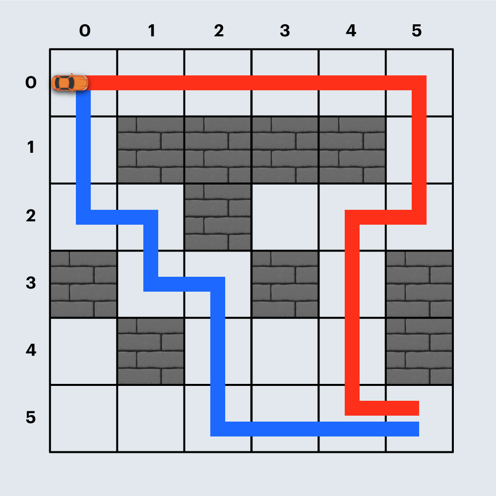

# [카카오 인턴] 경주로 건설

## 문제 설명

건설회사의 설계사인 죠르디는 고객사로부터 자동차 경주로 건설에 필요한 견적을 의뢰받았습니다.

제공된 경주로 설계 도면에 따르면 경주로 부지는 `N x N` 크기의 정사각형 격자 형태이며 각 격자는 `1 x 1` 크기입니다.

설계 도면에는 각 격자의 칸은 `0` 또는 `1` 로 채워져 있으며, `0`은 칸이 비어 있음을 `1`은 해당 칸이 벽으로 채워져 있음을 나타냅니다.

경주로의 출발점은 (0, 0) 칸(좌측 상단)이며, 도착점은 (N-1, N-1) 칸(우측 하단)입니다. 죠르디는 출발점인 (0, 0) 칸에서 출발한 자동차가 도착점인 (N-1, N-1) 칸까지 무사히 도달할 수 있게 중간에 끊기지 않도록 경주로를 건설해야 합니다.

경주로는 상, 하, 좌, 우로 인접한 두 빈 칸을 연결하여 건설할 수 있으며, 벽이 있는 칸에는 경주로를 건설할 수 없습니다.

이때, 인접한 두 빈 칸을 상하 또는 좌우로 연결한 경주로를 `직선 도로` 라고 합니다.
또한 두 `직선 도로`가 서로 직각으로 만나는 지점을 `코너` 라고 부릅니다.

건설 비용을 계산해 보니 `직선 도로` 하나를 만들 때는 100원이 소요되며, `코너`를 하나 만들 때는 500원이 추가로 듭니다.
죠르디는 견적서 작성을 위해 경주로를 건설하는 데 필요한 최소 비용을 계산해야 합니다.

예를 들어, 아래 그림은 `직선 도로` 6개와 `코너` 4개로 구성된 임의의 경주로 예시이며, 건설 비용은 6 x 100 + 4 x 500 = 2600원 입니다.


또 다른 예로, 아래 그림은 `직선 도로` 4개와 `코너` 1개로 구성된 경주로이며, 건설 비용은 4 x 100 + 1 x 500 = 900원 입니다.


도면의 상태(0은 비어 있음, 1은 벽)을 나타내는 2차원 배열 board가 매개변수로 주어질 때, 경주로를 건설하는데 필요한 최소 비용을 return 하도록 solution 함수를 완성해주세요.

## [제한사항]
- board는 2차원 정사각 배열로 배열의 크기는 3 이상 25 이하입니다.
- board 배열의 각 원소의 값은 0 또는 1 입니다.
  - 도면의 가장 왼쪽 상단 좌표는 (0, 0)이며, 가장 우측 하단 좌표는 (N-1, N-1) 입니다.
  - 원소의 값 0은 칸이 비어 있어 도로 연결이 가능함을 1은 칸이 벽으로 채워져 있어 도로 연결이 불가능함을 나타냅니다.
- board는 항상 출발점에서 도착점까지 경주로를 건설할 수 있는 형태로 주어집니다.
- 출발점과 도착점 칸의 원소의 값은 항상 0으로 주어집니다.

## 입출력 예

| board                                                                                                                                               | result |
| --------------------------------------------------------------------------------------------------------------------------------------------------- | ------ |
| `[[0,0,0],[0,0,0],[0,0,0]]`                                                                                                                         | 900    |
| `[[0,0,0,0,0,0,0,1],[0,0,0,0,0,0,0,0],[0,0,0,0,0,1,0,0],[0,0,0,0,1,0,0,0],[0,0,0,1,0,0,0,1],[0,0,1,0,0,0,1,0],[0,1,0,0,0,1,0,0],[1,0,0,0,0,0,0,0]]` | 3800   |
| `[[0,0,1,0],[0,0,0,0],[0,1,0,1],[1,0,0,0]]`                                                                                                         | 2100   |
| `[[0,0,0,0,0,0],[0,1,1,1,1,0],[0,0,1,0,0,0],[1,0,0,1,0,1],[0,1,0,0,0,1],[0,0,0,0,0,0]]`                                                             | 3200   |

## 입출력 예에 대한 설명
### 입출력 예 #1
본문의 예시와 같습니다.

### 입출력 예 #2

위와 같이 경주로를 건설하면 `직선 도로` 18개, `코너` 4개로 총 3800원이 듭니다.

### 입출력 예 #3

위와 같이 경주로를 건설하면 `직선 도로` 6개, `코너` 3개로 총 2100원이 듭니다.

### 입출력 예 #4

붉은색 경로와 같이 경주로를 건설하면 `직선 도로` 12개, `코너` 4개로 총 3200원이 듭니다.
만약, 파란색 경로와 같이 경주로를 건설한다면 `직선 도로` 10개, `코너` 5개로 총 3500원이 들며, 더 많은 비용이 듭니다.

# 풀이

## java

```java
class RaceTrack {

    class Position {
        int x; // x좌표
        int y; // y좌표
        int direction; // 방향
        int cost; // 비용

        public Position(int x, int y, int direction, int cost) {
            this.x = x;
            this.y = y;
            this.direction = direction;
            this.cost = cost;
        }
    }

    public int solution(int[][] board) {
        return go(board);
    }

    // 너비우선 탐색을 실행하는 메서드.
    private int go(int[][] boards) {
        int n = boards.length;
        int total = Integer.MAX_VALUE; // 최대값을 미리 담아 둠
        Queue<Position> queue = new LinkedList<>(); // Queue 선언
        int[] dirX = {-1, 1, 0, 0};
        int[] dirY = {0, 0, 1, -1};
        // 차례대로 왼쪽, 오른쪽, 위쪽, 아래쪽을 둘러봄.

        int x = 0; // 초기 위치 x
        int y = 0; // 초기 위치 y
        int dir = -1;
        int cost = 0; // 비용

        queue.add(new Position(x, y, dir, cost)); //

        while (!queue.isEmpty()) { // Queue가 빌 때까지 반복
            Position p = queue.poll();
            x = p.x;
            y = p.y;
            dir = p.direction;
            cost = p.cost;

            if (x == n - 1 && y == n - 1) { // 도착 지점에 이르렀을 때.
                total = (Math.min(cost, total));
                continue;
            }

            for (int i = 0; i < 4; i++) { // 왼쪽, 오른쪽, 위쪽, 아래쪽 4 방향 모두 탐색
                int nx = x + dirX[i];
                int ny = y + dirY[i];
                int tempCost = 0;

                if (nx >= 0 && nx < n && ny >= 0 && ny < n //범위를 벗어나지 않고
                        && boards[nx][ny] != 1 // 벽이 아니면
                ) {
                    if (dir == -1 || dir == i) { //방향에 따라 비용을 변경
                        // 어느방향으로도 갈 수 있거나, 직진인 경우.
                        tempCost = cost + 100;
                    } else {
                        // 방향이 달라진 경우에는 코너이므로 600원 추가.
                        tempCost = cost + 600;
                    }

                    if (boards[nx][ny] == 0 || boards[nx][ny] >= tempCost) {
                        // 처음 방문하는 위치거나, 비용이 더 작은 경우에 비용을 갱신해준다.
                        boards[nx][ny] = tempCost;
                        queue.offer(new Position(nx, ny, i, tempCost));
                    }
                }
            }
        }
        return total;
    }
}
```
계속 혼자 고민도 해보고, 남들이 풀어놓은 답들도 보고 해가면서 낸 결론인데
이런 류의 문제가 너무 어렵네요 ㅠ...