# 알고리즘(코딩테스트) 공부 스터디 2기 - Git 관련 추가 가이드

## 소스트리와 깃이 설치되어 있단 가정하에 시작합니다. 보시면서 그대로 따라하시고 이해하셨다면 돌발 상황에서도 잘 대처하실겁니다.

## 1. SourceTree 실행 후 Repository를 clone 합니다.
### New Tab을 누르시고 아래 그림처럼 하면 됩니다.
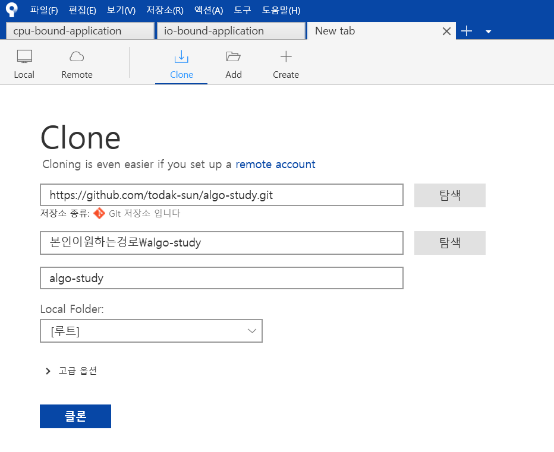

## 2. 혹시 원격저장소에 새로운 것이 반영되어 있을지 모르니 Fetch를 합니다.
### 아래 그림처럼 SourceTree 메뉴탭을 보면 패치가 있는데 클릭하시고 확인을 누르시면 됩니다.
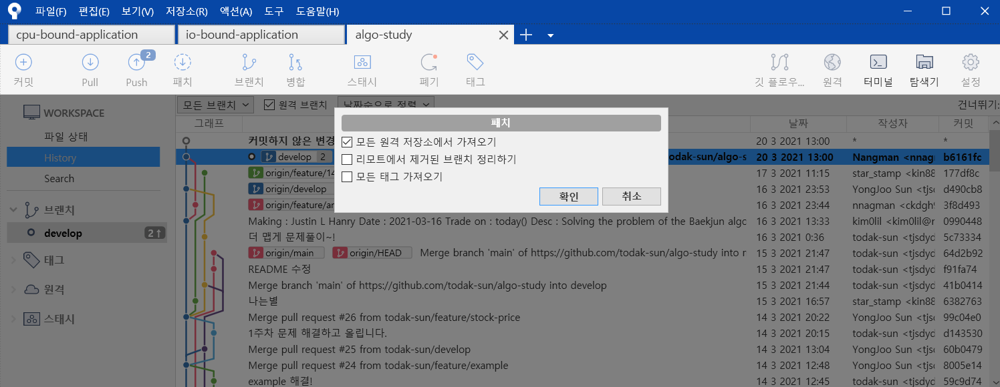

## 3. 이제 브랜치를 바꿔야 합니다. 우리의 작업물들은 feature에 올려야 하니깐요.
### 메뉴탭에서 브랜치를 클릭하시면 아래와 같은 화면이 뜨는데, 사진처럼 입력하시면 됩니다.
### 아니면 feature/{본인이입력하고싶은대로} 하셔도 됩니다.
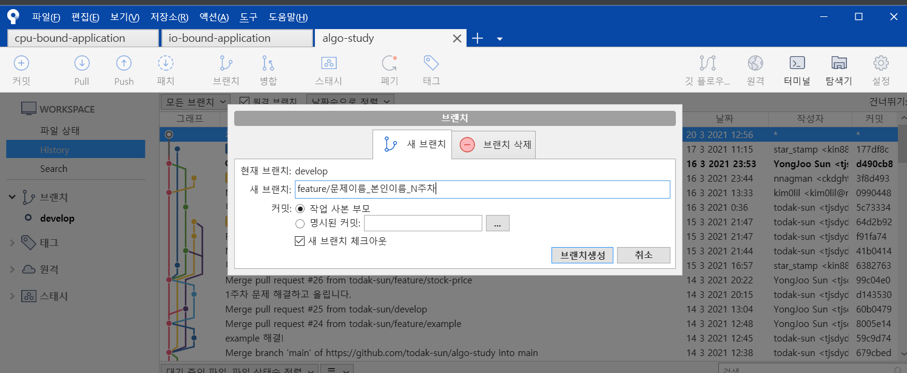

### 브랜치 생성된 것을 확인 할 수 있습니다.
### 생성하면 자동적으로 체크아웃이 될건데, 그렇지 않다면 다음 과정을 따라하시면 됩니다.
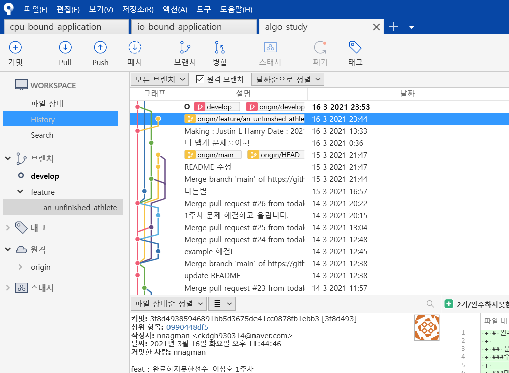

### 체크아웃해야될 브랜치에 오른쪽 클릭 후 체크아웃을 클릭하시면 됩니다.
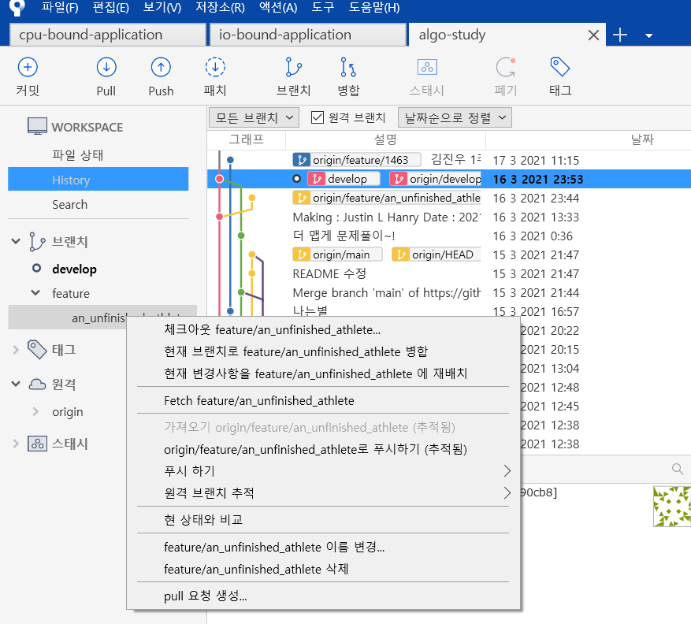

### 혹시 이미 만든 브랜치에 체크아웃하고 싶은데, 브랜치에는 안보인다면 사진처럼 원격 탭에서 찾아야 합니다.

### 여기서도 체크아웃할 브랜치에 오른쪽 클릭 후 체크아웃을 누릅니다.
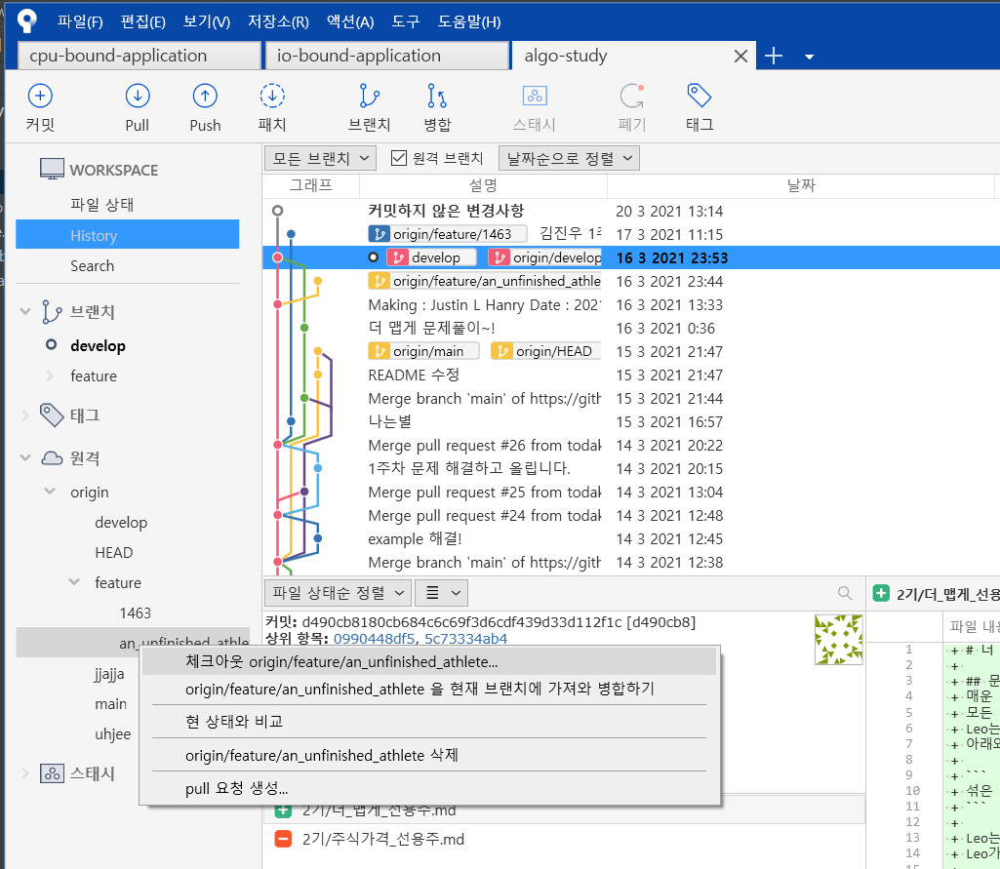

### 사진과 같은 화면이 뜨면 확인을 누르시면 브랜치 탭에 추가된 것을 확인 할 수 있습니다.
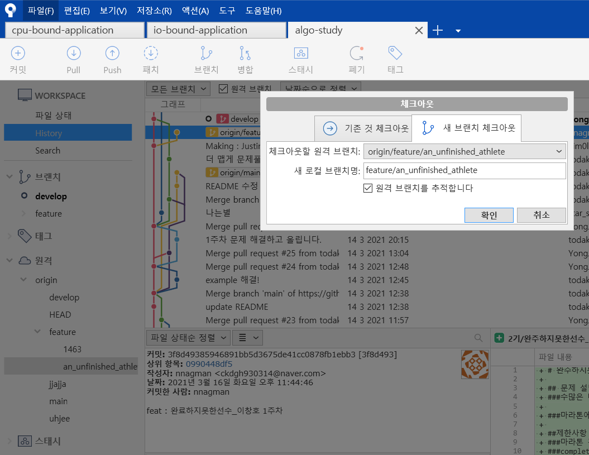

## 4. 브랜치에서 작성한 내용을 원격 저장소에 올려야지 풀리퀘스트를 보낼 수 있습니다. 그러기 위해선 우선 커밋을 해야합니다.
### 상단 탭에 커밋을 누르세요.
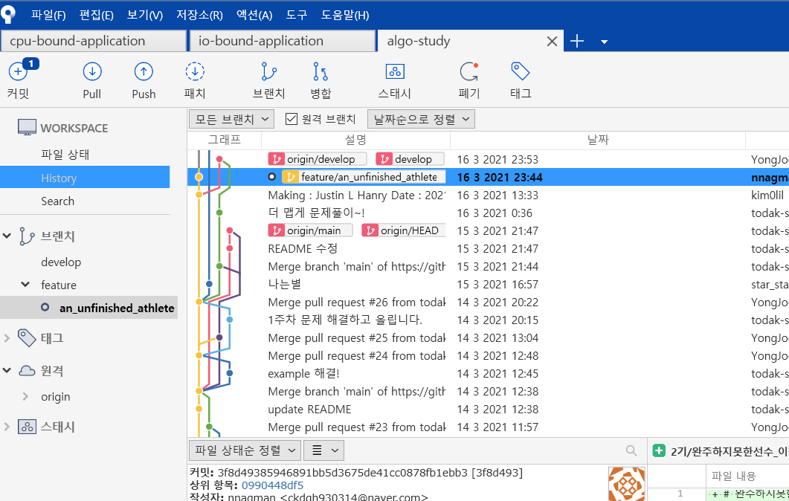

### 스테이지에 올리가지 않은 파일들이 있는데, 여기서 수정한 파일들만 골라서 올려야 합니다.
### IDE 관련 설정 파일들은 굳이 원격저장소에 올릴 필요가 없습니다.
### 정말로 스테이지에 올릴 파일들만 사진의 '+' 기호를 눌러 올려줍니다.
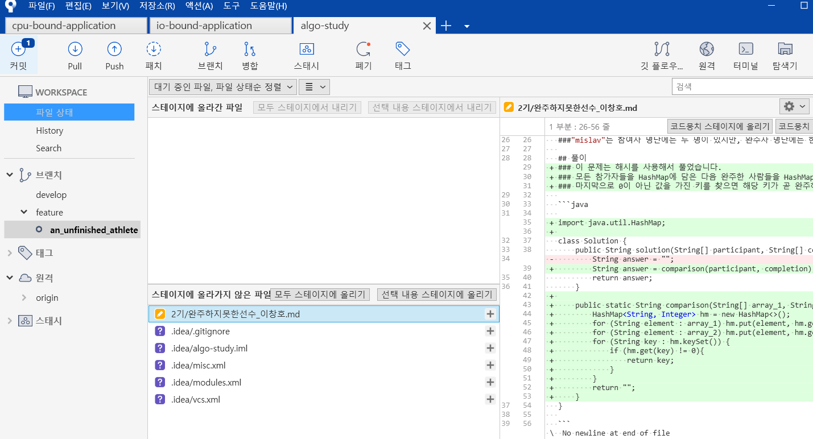

### 수정한 소스파일을 올렸으면 사진의 하단에 커밋 메시지를 입력하고 커밋을 누르면 됩니다.
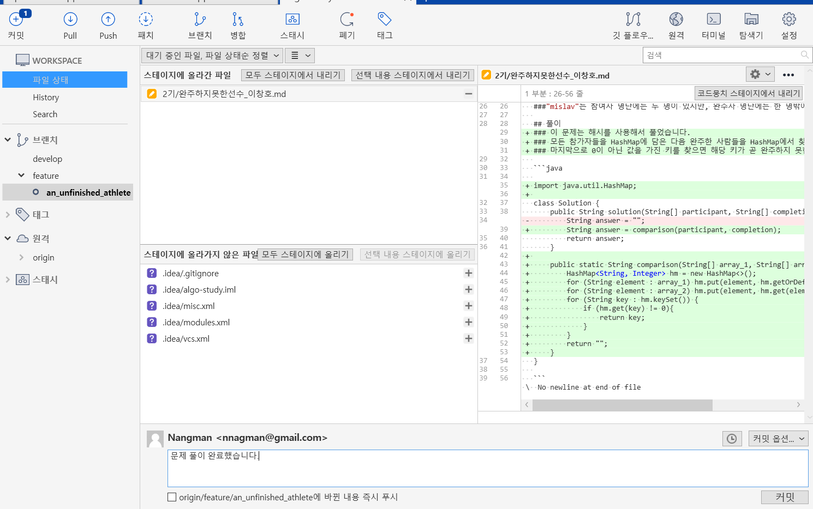

## 5. 커밋을 마쳤다면 마지막으로 푸시를 하여 원격저장소에 올려야 합니다.
### 커밋을 마친 뒤, 상단 탭에 푸시를 클릭합니다.
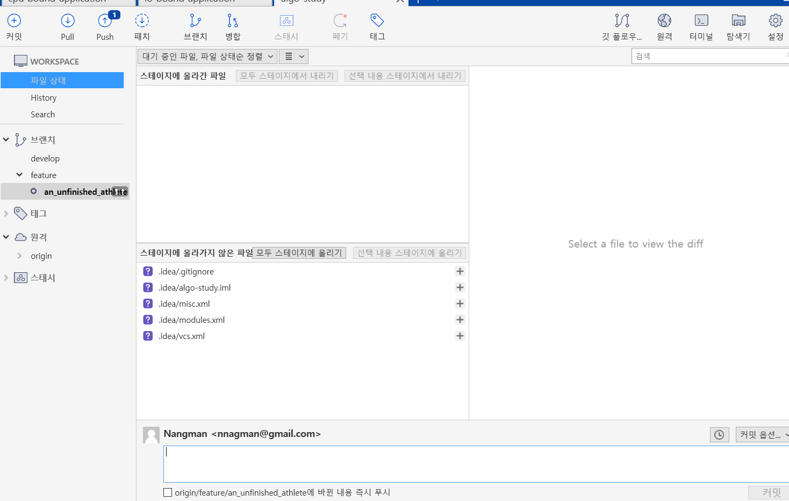

### 여기서 본인이 푸시 올릴 브랜치만 체크하신 뒤 Push 버튼을 누르시면 됩니다.
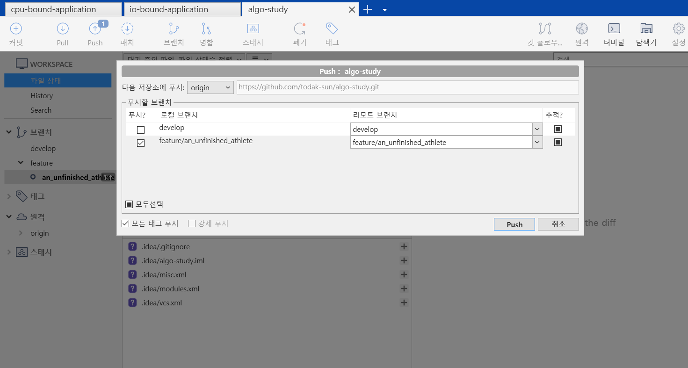

## 6. 이제 브랜치를 develop과 합쳐야 하니 풀리퀘스트를 올려야 합니다.
### 깃허브에 로그인하시고 Repository에 들어가신 뒤 상단 탭에 Pull Request를 클릭하시면 사진과 같은 화면이 뜰겁니다.
### 여기서 New Pull Request를 눌러주세요.
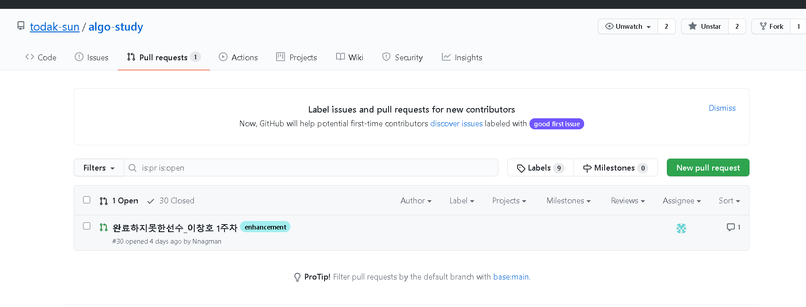

### 중요한 부분입니다. 좌측은 머지를 해서 합쳐질 베이스가 되는 브랜치이고 우측은 머지를 요청할 하위 브랜치입니다.
### develop이 feature의 상위 브랜치 개념이니 좌측엔 develop 우측엔 feature 브랜치로 설정합니다.
### 그 뒤, Create pull request를 눌러줍니다.
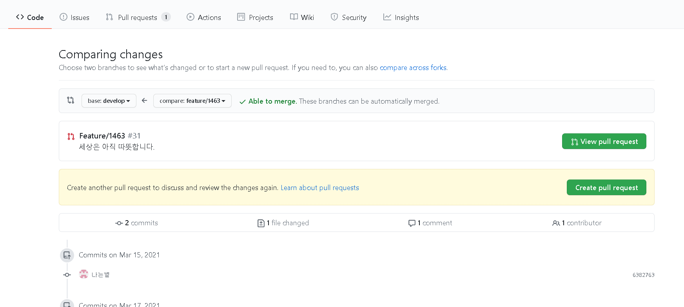

### 제목은 왠만하면 한글이나 알아 보기 쉬운 영어로 해주시고 제목에 간략한 설명이나 부가 설명을 적어주시면 좋습니다.
### 우측에 Reviewers에는 본인을 제외한 스터디 참가하고 있는 사람들로 추가해주세요.
### Assignee는 본인으로 해주세요. 마지막으로 Labels는 상황에 맞게 해주시면 됩니다.
### 그 뒤, Create pull request를 해주시면 완료입니다.
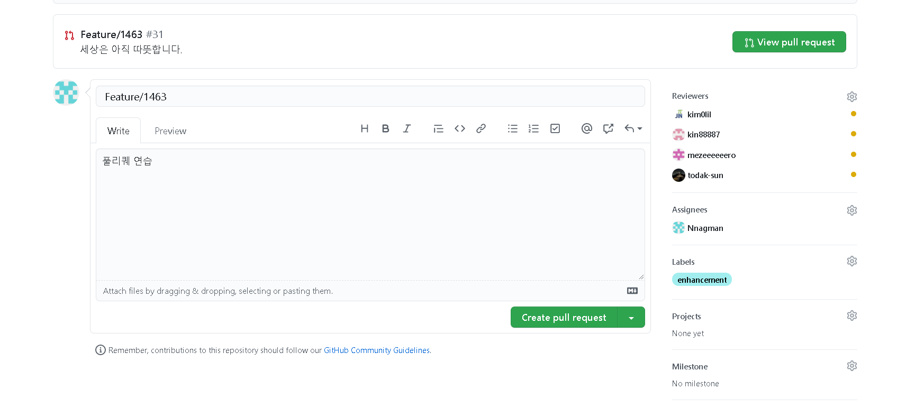

## 7. 끝

### 이제 끝입니다. 이 과정들을 반복하시면 됩니다.

### 단순히 따라하기만 하고 이해를 못하겠다 싶으신 분들은 아래와 같은 순서로 공부해주세요.

### 1. Git - 구글에서 '깃 가이드', '깃 이란' 이런거 검색하면 자료 잘 나옵니다.

### 2. GitHub - 구글링하세요.

### 3. GitFlow - https://danielkummer.github.io/git-flow-cheatsheet/index.ko_KR.html